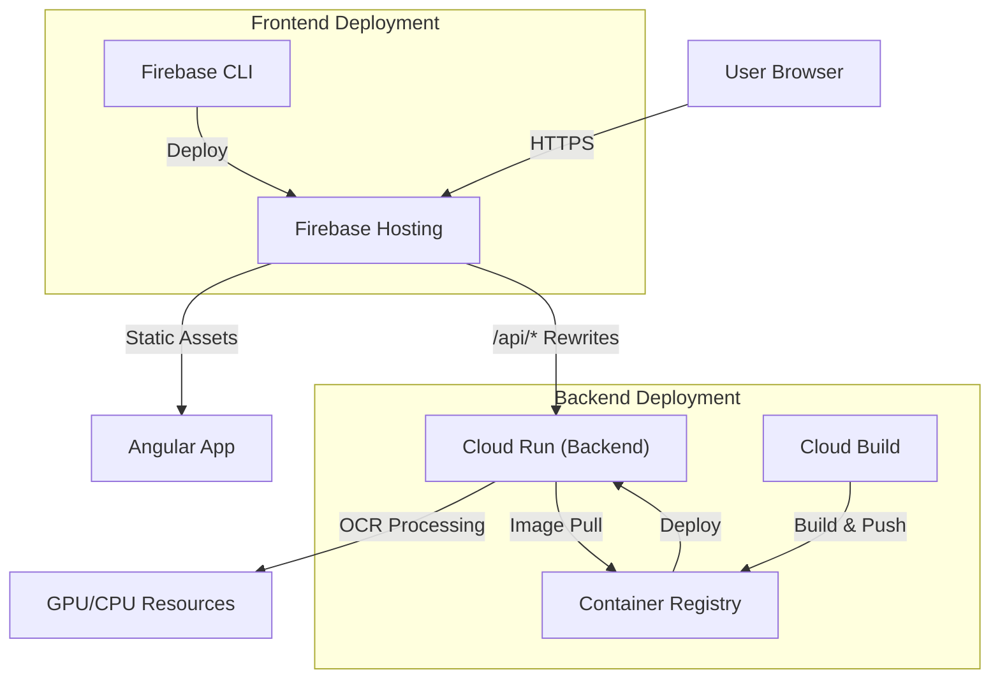

# Alcohol Label Verifier

**Live Demo:** [https://alv-2025.web.app/](https://alv-2025.web.app/)

AI-assisted toolkit that mirrors a simplified TTB review workflow. An Angular 18 SPA collects form submissions and label images, then a FastAPI service runs EasyOCR against the artwork and applies domain rules (brand, class/type, ABV, net contents, government warning). Results are streamed back with audible pass/fail cues so reviewers can keep cycling quickly.

## Stack
- **Backend** (`backend/`): FastAPI + EasyOCR + PyTorch, pytest suite with real bourbon label fixtures from Wikimedia Commons.
- **Frontend** (`label-verifier-ui/`): Angular 18 standalone app with reactive forms, drag-and-drop uploader, animated scoreboards, and pass/fail audio cues.
- **Fixtures**: `backend/tests/data/labels` contains real label images used both in tests and in the sample prefill buttons.

## Deployment Architecture



## Matching Logic

The verification engine uses a multi-stage fuzzy matching approach to handle OCR imperfections (glare, distortion, stylized fonts).

```mermaid
graph TD
    Start["Input: Form Payload + OCR Text"] --> Norm["Normalization"]
    Norm -->|Standard & Aggressive| Checks

    subgraph Checks
        subgraph Brand
            B1{"Exact Match?"} -->|Yes| B_Pass["Pass"]
            B1 -->|No| B2{"Aggressive Match?"}
            B2 -->|Yes| B_Pass
            B2 -->|No| B3{"Fuzzy Token Match?"}
            B3 -->|Yes| B_Pass
            B3 -->|No| B_Fail["Fail"]
        end

        subgraph Class
            C1{"Exact Match?"} -->|Yes| C_Pass["Pass"]
            C1 -->|No| C2{"Synonym Match?"}
            C2 -->|Yes| C_Pass
            C2 -->|No| C3{"Fuzzy Token Match?"}
            C3 -->|Yes| C_Pass
            C3 -->|No| C_Fail["Fail"]
        end

        subgraph ABV
            A1["Extract Candidates"] --> A2{"Within Tolerance?"}
            A2 -->|Yes| A_Pass["Pass"]
            A2 -->|No| A_Fail["Fail"]
        end

        subgraph Net
            N1{"Exact Match?"} -->|Yes| N_Pass["Pass"]
            N1 -->|No| N2{"Compact Match?"}
            N2 -->|Yes| N_Pass
            N2 -->|No| N3{"Missing Decimal?"}
            N3 -->|Yes| N_Pass
            N3 -->|No| N4{"Fuzzy Volume?"}
            N4 -->|Yes| N_Pass
            N4 -->|No| N5{"Volume Parsing?"}
            N5 -->|Yes| N_Pass
            N5 -->|No| N_Fail["Fail"]
        end
    end

    Checks --> Result["Verification Report"]
```



## Running Locally

### Quick Start
We provide helper scripts to spin up both the backend (FastAPI) and frontend (Angular) in one go.

**Mac / Linux**
```bash
chmod +x start.sh
./start.sh
```

**Windows**
```cmd
start.bat
```

The app will open at `http://localhost:4200` and the API at `http://localhost:8000`.

### Manual Setup

If you prefer to run services individually or use Docker:

#### Prerequisites
- Python 3.11+
- Node.js 18+
- Docker (optional)

#### Backend (FastAPI)

**Option 1: Python Virtual Environment**

```bash
cd backend
python -m venv .venv

# Mac/Linux
source .venv/bin/activate

# Windows
# .venv\Scripts\activate

pip install -r requirements.txt
uvicorn app.main:app --reload
```
The API will be available at `http://localhost:8000`.

**Option 2: Docker**

```bash
# Build the image
docker build -t alv-backend backend/

# Run the container
docker run -p 8000:8000 alv-backend
```

### Frontend (Angular)

```bash
cd label-verifier-ui
npm install
npm start
```
The application will run at `http://localhost:4200`. The dev server proxies API calls to `http://localhost:8000/api`.

## Running Tests

The backend includes a comprehensive test suite covering rule logic and end-to-end OCR flows.

```bash
cd backend
# Activate your virtual environment first
pytest
```
*Note: The first run downloads EasyOCR weights (~80 MB).*

## Deployment

The project is deployed on Google Cloud Platform using Cloud Run (Backend) and Firebase Hosting (Frontend).

### 1. Backend Deployment (Cloud Run)

We use Cloud Build to build the Docker image (supporting GPU) and deploy it to Cloud Run.

```bash
# Set your project
gcloud config set project alv-2025

# Submit build (uses backend/cloudbuild-gpu.yaml)
gcloud builds submit backend --config backend/cloudbuild-gpu.yaml

# Deploy to Cloud Run
gcloud run deploy alv-backend-gpu \
  --image gcr.io/alv-2025/alv-backend:gpu \
  --region us-central1 \
  --platform managed \
  --allow-unauthenticated
```

### 2. Frontend Deployment (Firebase)

The frontend is hosted on Firebase, which also handles routing API requests to the Cloud Run backend.

```bash
cd label-verifier-ui

# Install and Build
npm install
npm run build

# Deploy to Firebase
firebase deploy
```

## Project Layout
```
backend/
  app/
    config.py           # runtime settings + matcher thresholds
    matcher.py          # brand/class/abv/net-content/government warning rules
    ocr.py              # OCR wrapper + preprocessing (EasyOCR default, Paddle-ready)
    services/           # VerifierService orchestrating OCR + rules
    main.py             # FastAPI wiring, multipart endpoint, CORS
  tests/
    data/labels/*.png   # Wikimedia Commons fixtures
    test_matcher.py     # unit tests for fuzzy matching logic
    test_api_verification.py  # end-to-end OCR checks with real images
label-verifier-ui/
  src/app/
    app.component.*     # reactive UI, drag-drop, scoreboard, sounds
    models.ts           # shared interfaces for API payloads
    verification.service.ts  # HTTP client wrapper
```

## Notes & Extensions
- Government warning detection defaults to required; disable per submission for legacy samples.
- `window.__ALV_API__` can be defined before app bootstrap to point the UI at a remote backend without rebuilding.
- Future ideas: highlight OCR bounding boxes, multi-product workflows, or queue integrations.

